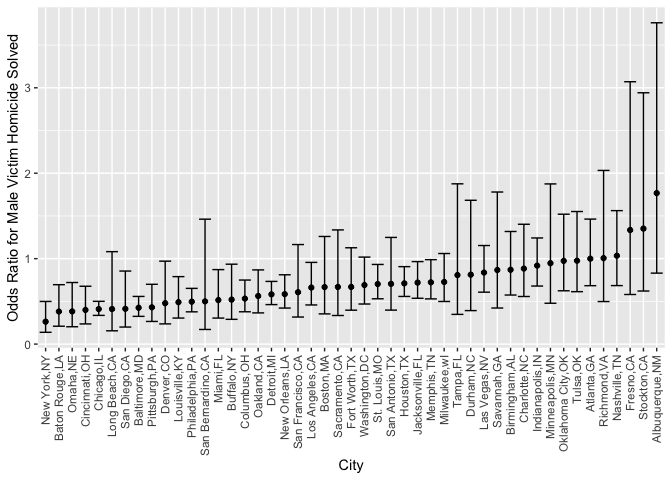
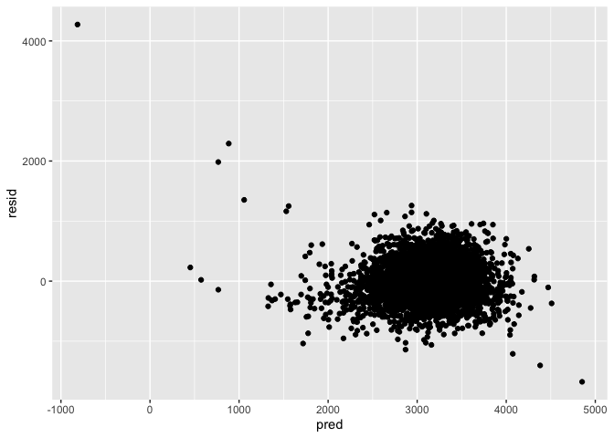
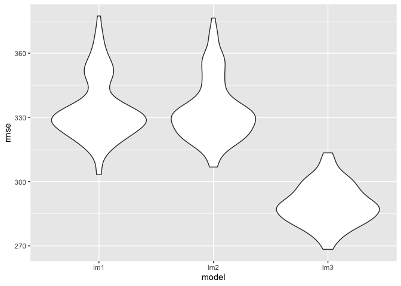

P8105_hw6_yj2752
================
Yixuan Jiao

## Import packages

``` r
library(tidyverse)
```

    ## ── Attaching packages ─────────────────────────────────────── tidyverse 1.3.2 ──
    ## ✔ ggplot2 3.3.6      ✔ purrr   0.3.5 
    ## ✔ tibble  3.1.8      ✔ dplyr   1.0.10
    ## ✔ tidyr   1.2.0      ✔ stringr 1.4.1 
    ## ✔ readr   2.1.2      ✔ forcats 0.5.2 
    ## ── Conflicts ────────────────────────────────────────── tidyverse_conflicts() ──
    ## ✖ dplyr::filter() masks stats::filter()
    ## ✖ dplyr::lag()    masks stats::lag()

``` r
library(purrr)
library(modelr)
```

## Problem2

First, cleaning the dataset. Certain cities have been excluded, only
white and black are kept for race analysis. Unknown sex are dropped.

``` r
homicide <- 
  read_csv("./data/homicide-data.csv") %>%
  mutate(city_state = str_c(city,",",state),
         victim_age = as.numeric(victim_age),
         resolved_binary = if_else(disposition == "Closed by arrest", 1, 0)) %>%
  filter(! city_state %in% c("Dallas,TX" ,"Phoenix,AZ","Kansas City,MO","Tulsa,AL")) %>%
  filter(victim_race %in% c("White","Black")) %>%
  filter(victim_sex %in% c("Male","Female")) %>%
  select(city_state,resolved_binary,victim_age,victim_race,victim_sex)
```

Fitting the linear model for Baltimore, MD with resolved status as
outcome and age, sex, race as predictors.

``` r
fit_logistic_homicide = 
  homicide %>% 
  filter(city_state == "Baltimore,MD") %>%
  glm(resolved_binary ~ victim_age + victim_race + victim_sex, data = ., family = binomial()) 
```

The model shows that the odds ratio for solving homicides comparing male
victims to female victims is 0.426 with confidence interval
(0.325,0.558).

``` r
fit_logistic_homicide %>% 
  broom::tidy() %>% 
  mutate(OR = exp(estimate),
         CI_lower = exp(estimate - 1.96*std.error),
         CI_upper = exp(estimate + 1.96*std.error)) %>%
  select(term, log_OR = estimate, OR, CI_lower, CI_upper, p.value) %>% 
  knitr::kable(digits = 3)
```

| term             | log_OR |    OR | CI_lower | CI_upper | p.value |
|:-----------------|-------:|------:|---------:|---------:|--------:|
| (Intercept)      |  0.310 | 1.363 |    0.975 |    1.907 |   0.070 |
| victim_age       | -0.007 | 0.993 |    0.987 |    1.000 |   0.043 |
| victim_raceWhite |  0.842 | 2.320 |    1.648 |    3.268 |   0.000 |
| victim_sexMale   | -0.854 | 0.426 |    0.325 |    0.558 |   0.000 |

Same procedure is applied to each city in the dataset. Data from each
city will generate a unique model storing the column linear model. Tidy
and unnest the column and only keep the vicitim_sexMale term to make the
plot.

``` r
homicide <- 
  homicide %>%
  nest(data = -city_state) %>%
  mutate(linear_model = map(.x = data, ~glm(resolved_binary ~ victim_age + victim_race + victim_sex, data = .x, family =  binomial()) %>% broom::tidy())) %>%
  unnest(linear_model) %>%
  mutate(OR = exp(estimate),
         CI_lower = exp(estimate - 1.96*std.error),
         CI_upper = exp(estimate + 1.96*std.error)) %>%
  select(city_state,term, log_OR = estimate, OR, CI_lower, CI_upper, p.value) %>%
  filter(term == "victim_sexMale")

head(homicide) %>% knitr::kable(digits = 3)
```

| city_state     | term           | log_OR |    OR | CI_lower | CI_upper | p.value |
|:---------------|:---------------|-------:|------:|---------:|---------:|--------:|
| Albuquerque,NM | victim_sexMale |  0.570 | 1.767 |    0.831 |    3.761 |   0.139 |
| Atlanta,GA     | victim_sexMale |  0.000 | 1.000 |    0.684 |    1.463 |   1.000 |
| Baltimore,MD   | victim_sexMale | -0.854 | 0.426 |    0.325 |    0.558 |   0.000 |
| Baton Rouge,LA | victim_sexMale | -0.964 | 0.381 |    0.209 |    0.695 |   0.002 |
| Birmingham,AL  | victim_sexMale | -0.139 | 0.870 |    0.574 |    1.318 |   0.511 |
| Boston,MA      | victim_sexMale | -0.404 | 0.667 |    0.354 |    1.260 |   0.212 |

The plots shows the odds ratio of each cities with CI as error bar. Most
cities (except Albuquerque, Stockton, Fresno, Nashville, and Richmond)
have OR lower than 1, meaning that in different extent, the odds of
having a male victim homicide case solved is generally lower among the
female victim cases.

``` r
homicide %>%
  mutate(city_state = fct_reorder(city_state,OR)) %>%
  ggplot(aes(x = city_state, y = OR)) +
  geom_point() +
  geom_errorbar(aes(ymin = CI_lower, ymax = CI_upper)) +
  labs(y = "Odds Ratio for Male Victim Homicide Solved",
       x = "City") +
  theme(axis.text.x = element_text(angle = 90, vjust = 0.5, hjust=1))
```

<!-- -->

## Problem3

First, load the dataset and clean the data. The data set has no missing
value. I changed babysex’s number into two factors.

``` r
baby <- 
  read_csv("data/birthweight.csv") %>%
  mutate(babysex = if_else(babysex == 1,"male","female"))
```

    ## Rows: 4342 Columns: 20
    ## ── Column specification ────────────────────────────────────────────────────────
    ## Delimiter: ","
    ## dbl (20): babysex, bhead, blength, bwt, delwt, fincome, frace, gaweeks, malf...
    ## 
    ## ℹ Use `spec()` to retrieve the full column specification for this data.
    ## ℹ Specify the column types or set `show_col_types = FALSE` to quiet this message.

By searching on internet, I believe mother’s and baby’s physical
condition is crucial to the birthweight. So I decide to build the model
according to baby’s physical measure and certain mother’s important
measures.

``` r
lm1 <- lm(bwt ~ babysex + blength + momage + parity + delwt + ppwt, data = baby)
```

The predictions vs. residuals polot is shown below, most of the part is
around 0.

``` r
baby %>%
  add_residuals(lm1) %>%
  add_predictions(lm1) %>%
  ggplot(aes(x = pred, y = resid)) + 
  geom_point()
```

<!-- --> The
formulas for other 2 models are shown below with their summary

``` r
lm2 <- lm(bwt ~ blength + gaweeks, data = baby)
lm3 <- lm(bwt ~ (bhead + blength + babysex)^3, data = baby)
lm2 %>% broom::tidy()
```

    ## # A tibble: 3 × 5
    ##   term        estimate std.error statistic  p.value
    ##   <chr>          <dbl>     <dbl>     <dbl>    <dbl>
    ## 1 (Intercept)  -4348.      98.0      -44.4 0       
    ## 2 blength        129.       1.99      64.6 0       
    ## 3 gaweeks         27.0      1.72      15.7 2.36e-54

``` r
lm3 %>% broom::tidy()
```

    ## # A tibble: 8 × 5
    ##   term                      estimate std.error statistic    p.value
    ##   <chr>                        <dbl>     <dbl>     <dbl>      <dbl>
    ## 1 (Intercept)                -802.    1102.       -0.728 0.467     
    ## 2 bhead                       -16.6     34.1      -0.487 0.626     
    ## 3 blength                     -21.6     23.4      -0.926 0.354     
    ## 4 babysexmale               -6375.    1678.       -3.80  0.000147  
    ## 5 bhead:blength                 3.32     0.713     4.67  0.00000317
    ## 6 bhead:babysexmale           198.      51.1       3.88  0.000105  
    ## 7 blength:babysexmale         124.      35.1       3.52  0.000429  
    ## 8 bhead:blength:babysexmale    -3.88     1.06     -3.67  0.000245

The cross validation result shows my model is similar to the model that
only contains 2 main effect. And the last model contains head
circumstance, length and sex and all interactions has overall lower rmse
distribution (indicating that’s possibly a better model comparing the
first 2).

``` r
crossv_mc(baby,100) %>%
  mutate(
    train = map(train, as_tibble),
    test = map(test, as_tibble)) %>%
  mutate(
    lm1 = map(train,~lm(bwt ~ babysex + blength + momage + parity + delwt + ppwt, data = .x)),
    lm2 = map(train,~lm(bwt ~ blength + gaweeks, data = .x)),
    lm3 = map(train,~lm(bwt ~ (bhead + blength + babysex)^3, data = .x))) %>%
  mutate(
    rmse_lm1 = map2_dbl(lm1, test, ~rmse(model = .x, data = .y)),
    rmse_lm2 = map2_dbl(lm2, test, ~rmse(model = .x, data = .y)),
    rmse_lm3 = map2_dbl(lm3, test, ~rmse(model = .x, data = .y))
  ) %>% 
  select(starts_with("rmse")) %>% 
  pivot_longer(
    everything(),
    names_to = "model", 
    values_to = "rmse",
    names_prefix = "rmse_") %>% 
  mutate(model = fct_inorder(model)) %>% 
  ggplot(aes(x = model, y = rmse)) + geom_violin()
```

    ## Warning in predict.lm(model, data): prediction from a rank-deficient fit may be
    ## misleading

<!-- -->
